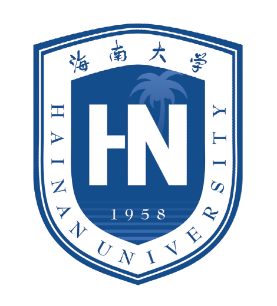

# 三亚海古纪生物科技有限公司

## 企业愿景
成为全球物种设计与智慧育种决策的创新标杆，构建AI驱动的精准物种改造生态系统，以基因组大数据与AI算法重塑农业可持续发展范式。

## 企业使命
聚焦种业科技自主突破，打造高通量基因组解析、智能化分子设计及全链条AI育种技术体系，通过基因组大数据与人工智能深度融合，驱动动植物育种从传统经验模式向智能体设计范式跨越升级。

## 联系方式
- 公司地址：三亚市海南大学研究院D栋204
- 谢经理：16689001917
- 基因文库技术：江肆肆 18605560158
- 育种数据服务技术：何妙华 13907651197
- 高通量基因文库设备技术：杰瑞.葛 13601063401

## 合作
- [苏州中析生物信息有限公司](https://www.prcxi.com/)
  
- [海南大学](https://www.hainanu.edu.cn/)
  
  